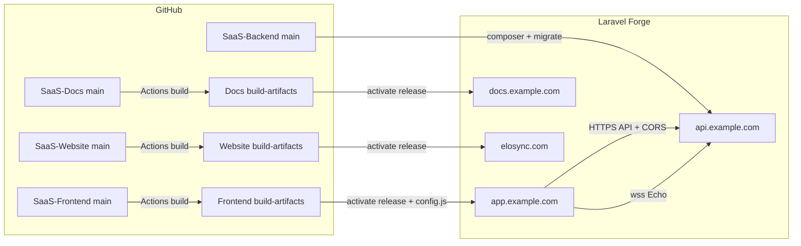

# Laravel Forge Deployment

Production-oriented guide for hosting EloSync / EloSync on **[Laravel Forge](https://forge.laravel.com/)**: four sites (API, SPA, Docs, Marketing), environment variables, deploy scripts, daemons, scheduler, Reverb, and email.

Use this with the [Production Runbook](./platform-production-runbook) (launch blockers / smoke) and [Notification System](./notifications) (Redis, Reverb TLS, Web Push). Local machines stay on [Installation](/getting-started/installation).

## Recommended topology

Create **four Forge sites** (same server or separate servers). Do not mix PHP API, SPA static files, docs, and marketing on one web root.

| Site | Domain example | Git repo | Branch | Web directory | Node on server |
|------|----------------|----------|--------|---------------|----------------|
| **API** | `api.example.com` | `DiligentCreators/SaaS-Backend` | `main` | `/public` | Not required |
| **SPA** | `app.example.com` | `DiligentCreators/SaaS-Frontend` | `build-artifacts` | `/` (site root) | **Not required** |
| **Docs** | `docs.example.com` | `DiligentCreators/SaaS-Docs` | `build-artifacts` | `/` (site root) | **Not required** |
| **Marketing** | `elosync.com` / `www.example.com` | `DiligentCreators/SaaS-Website` | `build-artifacts` | `/` (site root) | **Not required** |



**Rules**

- SPA, Docs, and Marketing: CI builds on merge to `main`; Forge deploys **compiled** `build-artifacts` only. Never run `npm ci` / `vite` / VitePress / `next build` on the Forge server for those sites.
- API: Forge runs Composer + `artisan` on each deploy. Prefer **zero-downtime** / quick deploy with shared `.env` and storage.
- One SPA artifact serves many clients: each Forge SPA site owns its own `.env` and generated `/config.js`.
- Marketing is a static Next.js export (`out/`) — no runtime Node, no `config.js`.

---

## Server prerequisites (Forge)

On the API server (or shared box):

| Service | Forge action |
|---------|----------------|
| PHP **8.3+** (8.4 preferred) | Site → PHP version |
| MySQL 8+ | Database → create DB + user |
| Redis | Server → Redis (install / enable) |
| Nginx + TLS | Site → SSL (Let's Encrypt) |
| Composer | Bundled with Forge PHP sites |
| Supervisor | Used by Daemons (queue, Reverb) |
| Scheduler | Site → Scheduler (or server cron) |

Enable **Redis** before setting `CACHE_STORE=redis` / `QUEUE_CONNECTION=redis`. Production must not use `database`/`file` cache with tenancy.

---

## 1. API site (SaaS-Backend)

### 1.1 Site settings

| Setting | Value |
|---------|--------|
| Repository | `DiligentCreators/SaaS-Backend` |
| Branch | `main` (or your release branch) |
| Project type | Laravel / PHP |
| Web directory | `public` |
| PHP version | 8.3+ / 8.4 |
| Composer | Install during deploy (`--no-dev`) |

### 1.2 Production `.env` (Forge → Environment)

Paste from backend `.env.example` (production-shaped template), then replace empty secrets. Shape:

```env
APP_NAME="EloSync"
APP_ENV=production
APP_DEBUG=false
APP_KEY=
APP_URL=https://api.example.com
FRONTEND_URL=https://app.example.com
CORS_ALLOWED_ORIGINS=https://app.example.com

CACHE_STORE=redis
QUEUE_CONNECTION=redis
CACHE_PREFIX=elosync_production_
REDIS_CLIENT=phpredis
REDIS_HOST=127.0.0.1
REDIS_PASSWORD=
REDIS_PORT=6379

BROADCAST_CONNECTION=reverb
REVERB_APP_ID=elosync
REVERB_APP_KEY=elosync-reverb-key
REVERB_APP_SECRET=
REVERB_HOST=reverb.example.com
REVERB_PORT=443
REVERB_SCHEME=https
REVERB_SERVER_HOST=127.0.0.1
REVERB_SERVER_PORT=8080
REVERB_ALLOWED_ORIGINS=https://app.example.com

FILESYSTEM_DISK=s3
FILESYSTEM_BRANDING_DISK=public
# Avatars always use public local storage (default). Keep storage/ shared across zero-downtime releases.
# FILESYSTEM_AVATAR_DISK=public
```

Redis is **required** whenever Reverb / production cache / queue are enabled. Do not leave `CACHE_STORE=database` with tenancy in production.

| Variable | Production note |
|----------|-----------------|
| `APP_DEBUG` | Must be `false` (boot fails closed if true in production) |
| `FRONTEND_URL` | Absolute SPA origin for reset/invite links |
| `CORS_ALLOWED_ORIGINS` | Pin SPA origin(s); never `*` |
| `REVERB_HOST` | Public WebSocket host (`reverb.example.com`); browsers use this via SPA `VITE_REVERB_*` |
| `REVERB_SERVER_*` | Internal listener behind Nginx (Forge Reverb proxy) |
| `CACHE_STORE` / `QUEUE_CONNECTION` | `redis` required with Reverb and tenancy |
| Mail | Prefer Central **Settings → Mail**; env is fallback only |
| Seeders | **Never** `db:seed` in production |

**Web Push (required for closed-browser alerts):** set `VAPID_SUBJECT` (`mailto:` or `https:`), `VAPID_PUBLIC_KEY`, and `VAPID_PRIVATE_KEY`. Generate once and keep stable (rotation invalidates browser push subscriptions). Queue daemon must consume `emails,default` — Web Push and optional FCM ride the same notification jobs. **Optional native FCM:** set API `FCM_PROJECT_ID` / `FCM_CLIENT_EMAIL` / `FCM_PRIVATE_KEY` (or `FCM_CREDENTIALS`) plus SPA `VITE_FIREBASE_*` in `/config.js`; omit to keep VAPID-only. See [Notification System](./notifications#web-push-ops-checklist-vapid-phase-4a) and [FCM checklist](./notifications#native-fcm-ops-checklist-phase-4b).

### 1.3 Deploy script (API)

Forge → Site → Deploy Script. Adjust paths only if your site path differs (`$FORGE_SITE_PATH`).

```bash
$CREATE_RELEASE()

cd $FORGE_RELEASE_DIRECTORY

$FORGE_COMPOSER install --no-dev --no-interaction --prefer-dist --optimize-autoloader

# storage/ is shared across zero-downtime releases — branding + avatars live under storage/app/public
$FORGE_PHP artisan storage:link --force || true
$FORGE_PHP artisan migrate --force
$FORGE_PHP artisan optimize
$FORGE_PHP artisan queue:restart
$FORGE_PHP artisan reverb:restart || true

$ACTIVATE_RELEASE()
```

**Do not** add `php artisan db:seed`, `migrate:fresh`, or `local:seed-demo`.

After first Multi-Provider Email release on an older DB, run once (SSH or one-off):

```bash
php artisan email:migrate-tenant-mail-modes
```

### 1.4 Scheduler

Forge → Site → **Scheduler** → enable (runs `schedule:run` every minute). Confirm jobs from the [Production Runbook](./platform-production-runbook) appear in `routes/console.php` / schedule definition.

### 1.5 Daemons (queue + Reverb)

Forge → Server → **Daemons** (or site Daemons). Use the site path Forge shows (example: `/home/forge/api.example.com`).

**Queue worker (notifications / default)**

| Field | Value |
|-------|--------|
| Command | `php artisan queue:work redis --queue=automations,whatsapp-inbound,whatsapp-outbound,emails,default --sleep=1 --tries=3 --timeout=90 --max-time=3600` |
| User | `forge` |
| Directory | `/home/forge/api.example.com/current` **or** `/home/forge/api.example.com` (match your zero-downtime layout) |
| Processes | `2` (scale with load) |

Include `whatsapp-inbound` and `whatsapp-outbound` when the WhatsApp Cloud module is enabled ([WhatsApp Cloud deployment](./whatsapp-cloud)).

**Queue worker (personal Email module — IMAP sync + send)**

| Field | Value |
|-------|--------|
| Command | `php artisan queue:work redis --queue=email-sync --sleep=1 --tries=3 --timeout=300 --max-time=3600` |
| User | `forge` |
| Directory | Same as API release root |
| Processes | `1` |

Requires PHP `ext-imap` on the server. Details: [Email deployment](./email#queue-worker-email-sync).

Prefer Forge’s “directory = current release” pattern so deploys + `queue:restart` pick up new code. If Daemons point at a fixed path, ensure it is the active release symlink.

**Reverb**

| Field | Value |
|-------|--------|
| Command | `php artisan reverb:start --host=127.0.0.1 --port=8080` |
| User | `forge` |
| Directory | Same as API release root |
| Processes | `1` |

Enable Forge **Laravel Reverb** / WebSocket proxy for the API site when available so Nginx terminates TLS and upgrades `/app` and `/apps`. Confirm:

- Public `wss://api.example.com` (or dedicated `ws.` host) matches SPA `VITE_REVERB_*`
- `REVERB_ALLOWED_ORIGINS` is exactly the SPA origin
- App secret never appears in SPA env

Supervisor examples and troubleshooting: [Notification System](./notifications).

### 1.6 First-time API bootstrap (once)

On a greenfield production database (SSH as `forge`):

```bash
cd /home/forge/api.example.com
php artisan key:generate   # if APP_KEY empty — then store in Forge Environment
php artisan migrate --force
# Create the first central admin via a controlled process — do NOT seed demo users in production
php artisan storage:link
```

Provision the first central user through your approved ops process (manual insert / one-off artisan), then sign in and configure **Settings → Mail**, payment gateways, and registration policy. Change any temporary password immediately.

### 1.7 Health

- `GET https://api.example.com/up` → 200 (DB + Redis when configured)
- Forge → Monitoring / uptime on `/up`

---

## 2. SPA site (SaaS-Frontend)

### 2.1 Site settings

| Setting | Value |
|---------|--------|
| Repository | `DiligentCreators/SaaS-Frontend` |
| Branch | **`build-artifacts`** |
| Web directory | `/` (compiled assets live at branch root) |
| Node.js | **Not required** for deploy |
| Nginx | SPA fallback to `index.html` for client routes |

If deep links 404, add a try_files fallback to `index.html` (Forge “Static HTML” / custom Nginx). Do not point Web Directory at `dist/` on `main` — that branch has no committed build.

### 2.2 Site `.env` (runtime only)

Forge Environment for the **SPA site** (not the API site):

```env
VITE_API_URL=https://api.example.com
VITE_APP_NAME=EloSync
VITE_API_MODE=central
VITE_REVERB_APP_KEY=<same-as-REVERB_APP_KEY>
VITE_REVERB_HOST=reverb.example.com
VITE_REVERB_PORT=443
VITE_REVERB_SCHEME=https
```

`VITE_API_URL` has **no** trailing `/api`. Reverb host/port/scheme must match backend `REVERB_HOST` / public WebSocket endpoint.

### 2.3 Deploy script (SPA)

```bash
$CREATE_RELEASE()

cd $FORGE_RELEASE_DIRECTORY

if [ -f ../../.env ]; then
  set -a
  source ../../.env
  set +a
fi

echo "window.env = {" > "$FORGE_RELEASE_DIRECTORY/config.js"
echo "  VITE_API_URL: \"$VITE_API_URL\"," >> "$FORGE_RELEASE_DIRECTORY/config.js"
echo "  VITE_APP_NAME: \"${VITE_APP_NAME:-EloSync}\"," >> "$FORGE_RELEASE_DIRECTORY/config.js"
echo "  VITE_API_MODE: \"${VITE_API_MODE:-central}\"," >> "$FORGE_RELEASE_DIRECTORY/config.js"
echo "  VITE_REVERB_APP_KEY: \"$VITE_REVERB_APP_KEY\"," >> "$FORGE_RELEASE_DIRECTORY/config.js"
echo "  VITE_REVERB_HOST: \"$VITE_REVERB_HOST\"," >> "$FORGE_RELEASE_DIRECTORY/config.js"
echo "  VITE_REVERB_PORT: \"$VITE_REVERB_PORT\"," >> "$FORGE_RELEASE_DIRECTORY/config.js"
echo "  VITE_REVERB_SCHEME: \"$VITE_REVERB_SCHEME\"" >> "$FORGE_RELEASE_DIRECTORY/config.js"
echo "};" >> "$FORGE_RELEASE_DIRECTORY/config.js"

$ACTIVATE_RELEASE()
```

No `npm install`, no `npm run build`. CI already published assets; this script only activates the release and writes `/config.js`.

Trigger: Forge GitHub webhook on `build-artifacts`, or deploy after Actions finishes. Wrong API URL → fix SPA site `.env` and redeploy (regenerates `config.js`).

Details: [Frontend Build Artifacts](/developer-guide/frontend-build-artifacts).

### 2.4 Cache headers (recommended)

| Path | Cache |
|------|--------|
| `index.html`, `config.js` | Short TTL or `no-cache` |
| `/assets/*` (hashed) | Long-lived immutable |

---

## 3. Docs site (SaaS-Docs)

### 3.1 Site settings

| Setting | Value |
|---------|--------|
| Repository | `DiligentCreators/SaaS-Docs` |
| Branch | **`build-artifacts`** |
| Web directory | `/` |
| Deploy script | Activate only |
| Node.js | **Not required** |

### 3.2 Deploy script (Docs)

```bash
$CREATE_RELEASE()

cd $FORGE_RELEASE_DIRECTORY

$ACTIVATE_RELEASE()
```

Clean URLs work on default Forge Nginx (`try_files $uri $uri/ …`) because CI writes directory `index.html` fallbacks. Optional:

```nginx
location / {
    try_files $uri $uri.html $uri/ /404.html;
}
```

---

## 4. Marketing site (SaaS-Website / EloSync)

### 4.1 Site settings

| Setting | Value |
|---------|--------|
| Repository | `DiligentCreators/SaaS-Website` |
| Branch | **`build-artifacts`** |
| Web directory | `/` |
| Deploy script | Activate only |
| Node.js | **Not required** |

### 4.2 Deploy script (Marketing)

```bash
$CREATE_RELEASE()

cd $FORGE_RELEASE_DIRECTORY

$ACTIVATE_RELEASE()
```

CI (`Website production build`) runs `next build` with `output: "export"` and publishes the `out/` directory to `build-artifacts`. Forge only activates the release — never run `npm` / `next` on the server.

Optional Nginx 404 fallback:

```nginx
location / {
    try_files $uri $uri/ /404.html;
}
```

Details: [SaaS-Website README](https://github.com/DiligentCreators/SaaS-Website) and repo `docs/ci-cd/website-build-artifacts.md`.

---

## 5. Email on Forge

1. Deploy API with queue daemon running (`emails,default`).
2. Sign in to Central → **Settings → Mail** → SMTP / Postmark / Mailgun (not Log).
3. Set From identity; configure provider webhooks to:
   - `https://api.example.com/webhooks/email/{provider}`
   - Tenant custom: `…/webhooks/email/{provider}/{tenant}`
4. **Send test**; confirm **Email logs**.
5. Ensure `FRONTEND_URL` is the production SPA so reset links work.

Env `MAIL_*` is only a fallback when Settings secrets are empty. Restart queue after credential changes (`queue:restart` is already in the API deploy script).

See [Multi-Provider Email](/developer-guide/multi-provider-email) and [Authentication ops](./authentication).

---

## 6. Cross-site checklist (before go-live)

### Wire-up

- [ ] API `APP_URL` = public API HTTPS URL
- [ ] API `FRONTEND_URL` + `CORS_ALLOWED_ORIGINS` + `REVERB_ALLOWED_ORIGINS` = SPA origin
- [ ] SPA `VITE_API_URL` = API origin
- [ ] SPA `VITE_REVERB_*` matches public Reverb (TLS, host, port 443, key)
- [ ] Stripe / Creem webhook URLs hit the API host; secrets non-empty for active gateways
- [ ] `BRANDED_SERVER_IPV4` (and optional CNAME) set if using custom domains

### Processes

- [ ] API scheduler enabled
- [ ] Queue daemon running (`emails,default`) — required for mail **and** Web Push notification jobs
- [ ] Reverb daemon + Nginx WebSocket proxy
- [ ] Redis up; `CACHE_STORE` / `QUEUE_CONNECTION` = `redis`
- [ ] `VAPID_SUBJECT` / `VAPID_PUBLIC_KEY` / `VAPID_PRIVATE_KEY` set (stable keys; `mailto:`/`https:` subject)
- [ ] Optional FCM: API `FCM_*` + SPA `VITE_FIREBASE_*` both complete, or both omitted

### Deploy paths

- [ ] API deploys from `main` with migrate + optimize + queue/reverb restart
- [ ] SPA deploys from `build-artifacts` with `config.js` generation
- [ ] Docs deploys from `build-artifacts` with activate-only script
- [ ] Marketing deploys from `build-artifacts` with activate-only script
- [ ] No production seeders / `migrate:fresh`

### Smoke

- [ ] `GET /up` on API
- [ ] Central + tenant login on SPA
- [ ] Forgot-password email leaves the queue
- [ ] Notification bell updates over Echo (or unread poll fallback)
- [ ] Docs homepage and a deep link load
- [ ] Marketing homepage loads (`elosync.com` or configured domain)

Full launch blockers: [Production Runbook](./platform-production-runbook).

---

## 7. Deploy order

When shipping a release that touches product repos:

1. **Backend** — merge → Forge API deploy (migrations first)
2. **Frontend** — merge → wait for Actions → `build-artifacts` → Forge SPA deploy
3. **Docs** — merge → wait for Actions → `build-artifacts` → Forge Docs deploy
4. **Marketing** — merge → wait for Actions → `build-artifacts` → Forge Marketing deploy (independent of API)

SPA may briefly talk to a newer API if you deploy backend first (preferred for additive APIs). Avoid deploying SPA features that require API routes before the API migrate finishes.

See [Release Process](./release-process).

---

## 8. Troubleshooting (Forge)

| Symptom | Check |
|---------|--------|
| SPA blank / wrong API | Site `.env` + redeploy so `config.js` regenerates; view-source `/config.js` |
| CORS errors | API `FRONTEND_URL` / `CORS_ALLOWED_ORIGINS` match SPA scheme+host |
| Echo never connects | Reverb daemon; Nginx `/app` `/apps`; SPA `VITE_REVERB_*`; `REVERB_ALLOWED_ORIGINS` |
| Mail stuck | Queue daemon; `failed_jobs`; Central Mail settings; not `MAIL_MAILER=log` |
| 500 after deploy | `APP_DEBUG=false` but check `storage/logs`; `php artisan optimize` / missing `APP_KEY` |
| Docs 404 on deep links | Branch is `build-artifacts`; Web Directory `/`; CI clean-url indexes present |
| Marketing 404 / blank | Branch is `build-artifacts` (not `main`); Web Directory `/`; Actions `Website production build` green |
| Stale SPA/docs/marketing | Confirm Forge site branch is `build-artifacts`, not `main`; redeploy after Actions |

---

## Related

| Topic | Doc |
|-------|-----|
| Launch blockers / smoke | [Production Runbook](./platform-production-runbook) |
| Reverb / Redis / Web Push | [Notification System](./notifications) |
| SPA CI + `config.js` | [Frontend Build Artifacts](/developer-guide/frontend-build-artifacts) |
| Migrate-only upgrades | [Upgrade Guide](./upgrade) |
| Local install | [Installation](/getting-started/installation) |
| Docs Forge notes | [SaaS-Docs README](https://github.com/DiligentCreators/SaaS-Docs) |
| Marketing CI | [SaaS-Website](https://github.com/DiligentCreators/SaaS-Website) `docs/ci-cd/website-build-artifacts.md` |
