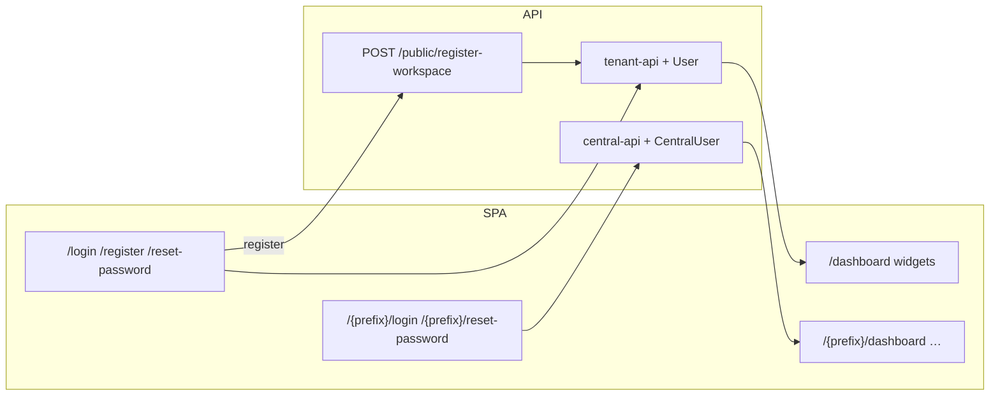

# Authentication

Tenant and Central authentication are fully isolated: separate route trees, Sanctum guards, user models, password-reset brokers, and SPA token storage.

## Architecture

| Concern | Tenant Application | Central Application |
|---------|--------------------|---------------------|
| SPA routes | `/login`, `/register`, `/forgot-password`, `/reset-password/{token}` | `/{prefix}/login`, `/{prefix}/forgot-password`, `/{prefix}/reset-password/{token}` (default prefix `central`) |
| API prefix | `/api/tenant/v1` | `/api/central/v1` |
| Guard | `tenant-api` | `central-api` |
| User model | `App\Models\User` (`users`) | `App\Models\CentralUser` (`central_users`) |
| Password broker | `users` | `central_users` |
| SPA token key | `dc_saas_token_tenant` | `dc_saas_token_central` |
| Token name | `tenant-token` | `central-token` |

A tenant login never authenticates a Central administrator, and a Central login never authenticates a tenant user.

`/login` is the shared tenant entry point. It includes a **Workspace** field when the browser host does not already resolve a workspace. Central login lives under the configurable HashRouter prefix (default `/central/login`) and never accepts a workspace.

### Custom Central path prefix (per install)

Operators who sell/host the platform can obscure the Central UI the same way WHMCS customizes `/admin`:

| Layer | Env | Example |
|-------|-----|---------|
| SPA (`config.js` / Vite) | `VITE_CENTRAL_PATH_PREFIX` | `dc-s87s` → `/#/dc-s87s/login` |
| API (password-reset / verify emails) | `CENTRAL_PATH_PREFIX` | must match the SPA value |

Keep both in sync on every install. Invalid or tenant-reserved prefixes fall back to `central`. **API routes stay `/api/central/v1`** — only the SPA path changes. This is obscurity, not a substitute for strong passwords, lockout, or MFA.

### Failed Central login alerts

Wrong-password attempts against a live Central account email:

- The targeted `CentralUser`
- Platform `support_email` (when set and different from the user)

Ordinary failures are throttled (one mail per account+IP per 15 minutes). Account lockouts always notify. Set **Central → Settings → Support email** so operators see probes even when the secret SPA path is guessed.

## Guards

Defined in `config/auth.php`:

- `central-api` — Sanctum driver, `central_users` provider
- `tenant-api` — Sanctum driver, `users` provider

Tenant routes also run `tenancy` + `tenant.available`. Workspace resolution prefers the request host (including future custom domains), then the authenticated token's workspace, then the submitted `workspace` value or `X-Tenant-Domain` header. Central routes run `central.domain`.

When a Bearer token is present but cannot resolve a workspace (unknown, revoked, or pruned token row), `InitializeTenancy` returns **401 Unauthenticated** so the SPA can redirect to login. A true missing-workspace case with no Bearer still returns **400** with `code: workspace_required`; the SPA treats that as session expiry on authenticated API calls (not `skipAuth`) so idle token-clear races hard-redirect to login instead of toasting.

Tenant token TTL comes from the workspace `session_lifetime_minutes` setting (`0` = non-expiring token), falling back to Central when unset. Remember-me still extends a positive TTL to at least 30 days.

The tenant SPA always stores the bearer token in **`localStorage`** (`dc_saas_token_tenant`) so new browser tabs share the same session. **Keep me signed in for 30 days** only affects the `remember` flag sent at login (server TTL). Central tokens still use `localStorage` when remember-me is checked and `sessionStorage` otherwise. Legacy tenant tokens found only in `sessionStorage` are promoted to `localStorage` on read.

Spatie roles/permissions are isolated by `guard_name` (`central-api` vs `tenant-api`).

## Registration

`POST /api/central/v1/public/register-workspace` honours `registration_enabled` for ordinary self-service registration. It also accepts an optional `invite_token`; a valid accepted, unexpired, unactivated Founding Beta invite bypasses disabled open registration:

1. Creates workspace + domain
2. `TenantProvisioningService` — billing profile, default-included modules (Leads, Tasks, ToDos), authorization defaults, module seed data
3. `TenantAuthBootstrapService::createOwner` — owner `User` with workspace `superadmin` role (roles must already exist)
4. Returns Sanctum `tenant-token` for immediate SPA login

Login and subsequent authenticated requests **do not** create or repair roles/permissions. See [tenant-provisioning.md](/developer-guide/tenant-provisioning).

Required body fields: `company_name`, `owner_name`, `email`, `password`, `password_confirmation`. The invite-led path adds `invite_token` (64 characters), requires the submitted email to match the beta application, and atomically marks the application activated after provisioning.

When registration is disabled and no invite token is supplied, the API returns 403 with message *We are not currently accepting new registrations.* The SPA `/register` route redirects to `/registration-closed`; tokenized invite links may still open registration.

## Password reset

| Step | Tenant | Central |
|------|--------|---------|
| Request | `POST /api/tenant/v1/auth/forgot-password` | `POST /api/central/v1/auth/forgot-password` |
| Email link | `{FRONTEND_URL}/reset-password/{token}?email=` | `{FRONTEND_URL}/central/reset-password/{token}?email=` |
| Reset | `POST /api/tenant/v1/auth/reset-password` | `POST /api/central/v1/auth/reset-password` |

Both reset endpoints use `App\Rules\PasswordRule`, which reads Central settings (`password_min_length`, `password_require_special`) plus always-on complexity rules.

Set `FRONTEND_URL` in the backend `.env` so reset/invite emails open the SPA.

## Profile avatar

Authenticated users can upload a profile picture on **Profile**. Multipart endpoints:

- `POST /api/central/v1/me/avatar` and `POST /api/tenant/v1/me/avatar` (`file`: jpg/jpeg/png/webp, max 2 MB)
- `DELETE /api/{central|tenant}/v1/me/avatar`

Stored via `UserAvatarService` under `central/users/{id}/avatars/` or `tenants/{tenantId}/users/{id}/avatars/` on the **avatar disk** (`FILESYSTEM_AVATAR_DISK`, default `public`). Avatars are never written to S3 when `FILESYSTEM_DISK=s3`. Serve them from `{APP_URL}/storage/...` and keep `storage/app/public` on shared/persistent storage across zero-downtime deploys. Login and `GET /me` return an absolute `avatar_url`; the SPA resolves relative asset URLs against the API origin so the topbar and sidebar show the photo instead of initials.

## Email verification

Tenant `User` and Central users implement `MustVerifyEmail`. Verification is required before protected Central and tenant application APIs can be used. Routes:

- `GET /api/tenant/v1/auth/email/verify/{id}/{hash}` (signed)
- `POST /api/tenant/v1/me/email/verification-notification` (self-service resend)
- `POST /api/tenant/v1/users/{user}/resend-verification` (`users.verify`; throttled `6,1`)
- `POST /api/tenant/v1/users/{user}/verify-email` (`users.verify`; manual mark verified)

Admin verify/resend cannot target self or (for non-owners) the workspace owner. Manual verify and resend write platform audit events `tenant_user_email_verified` / `tenant_user_verification_resent`.

## Impersonation compatibility

Login and registration issue tokens through `TenantAuthBootstrapService::issueAccessToken()` only — that service has **no authorization side effects**.  
`ImpersonationService` (Central) reuses the same token helper for Central → Tenant owner handoff when issuing a tenant token.

### Central platform impersonation

Central administrators with `impersonation.start` impersonate a workspace owner via `POST /api/central/v1/tenants/{tenant}/impersonate` (required `reason`, 5–1000 chars). The SPA:

1. Stashes the active Central Sanctum token as **`resumeToken`** in `sessionStorage` (via `impersonationStorage`) before swapping to the short-lived tenant bearer returned by the start response.
2. Ends the session with `POST /api/central/v1/impersonation/{id}/end`, passing **`skipSessionExpiry: true`** on the axios request so a transient 401 during token handoff does not clear the stashed Central session before `endImpersonation()` restores `resumeToken`.
3. Restores the Central admin context from `resumeToken` even when the end API fails (local cleanup + redirect to `/central/dashboard`).

History and audit surfaces (tenant details tabs):

| Endpoint | Permission | Notes |
|----------|------------|-------|
| `GET /api/central/v1/tenants/{tenant}/impersonation-sessions` | `impersonation.list` | Paginated; reason, admin, start/end, duration; **no tokens**; `is_active` / `is_expired` reflect `ended_at` and `expires_at` |
| `GET /api/central/v1/tenants/{tenant}/audit-logs` | `tenants.read` | Paginated platform `activity_log` rows scoped to the workspace |

List responses for audit logs **allowlist** `properties` keys (reason, impersonation session ids, duration, `tenant_id`, actor/ip metadata, module/subscription hints). Nested `before` / `after` blobs and other unreviewed keys are omitted from the API payload. Full write-path audit rows are unchanged; only the Central list resource redacts.

See [Central API v1 — Impersonation](/api/central-v1#impersonation) and [Admin UI — Tenant details](/user-guide/admin-ui#tenants).

### Tenant user impersonation

Workspace owners (permission `users.impersonate`) can start a same-workspace session as another non-owner user via `POST /api/tenant/v1/users/{user}/impersonate`. The SPA stashes the actor Sanctum token, swaps to the returned `target_token`, and restores the actor on `POST /api/tenant/v1/user-impersonation/{id}/end`. Nested impersonation is blocked when the active bearer token name is `impersonation` or `user-impersonation`. See [Tenant Users API](/api/tenant-v1-users#user-impersonation-login-as-user).

## Token ↔ workspace binding

Sanctum tenant tokens are not intrinsically bound to a workspace. Authenticated tenant routes use middleware `tenant.user` (`EnsureTenantUserBelongsToCurrentTenant`) so a token issued for workspace A is rejected (401) when `X-Tenant-Domain` / host resolves to workspace B.

`InitializeTenancy` re-resolves the tenant on every request and switches context when the domain/header changes (important for SPA clients that keep one API host and swap `X-Tenant-Domain`).

The SPA does not persist a workspace identifier in `localStorage`. It derives workspace context from the current host or the explicitly supplied login/request workspace, preventing stale browser state from selecting a different workspace.

## Rate limiting

- Login: `throttle:auth-login` (5/minute by email or IP)
- Forgot/reset password: `throttle:6,1`
- Register workspace: `throttle:10,1`

## Tenant dashboard

`GET /api/tenant/v1/dashboard` (auth + verified + subscription + `dashboard.view`) returns welcome copy, workspace info, installed modules, a **widget registry** (module + permission + assignee scoped), and overall `scope`. See [tenant-v1-dashboard.md](/api/tenant-v1-dashboard).
